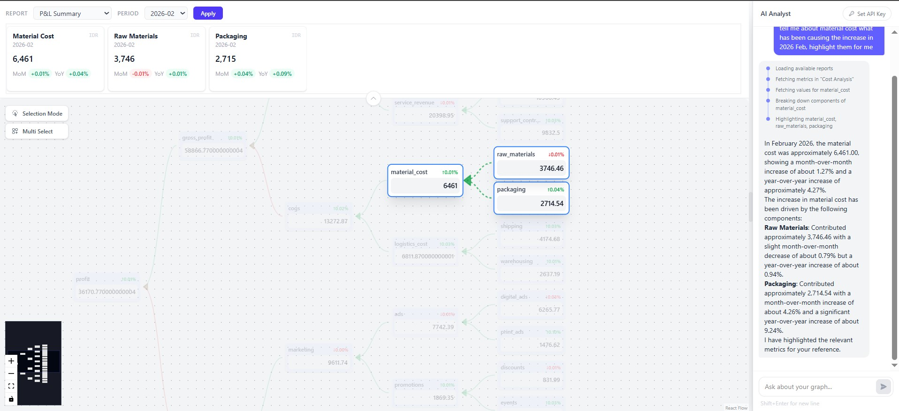

# claritree

**Live demo → [claritree.vercel.app](https://claritree.vercel.app)**

An interactive financial calculation tree paired with an AI analyst. Ask questions in plain English, get answers backed by real data, and watch the relevant nodes highlight on the graph in real time.



---

## Overview

Most financial tools let you query data. claritree lets you *understand* it.

The app renders your entire P&L as a navigable node graph — every metric, every formula, every dependency. An AI analyst sits alongside it with full access to the underlying database. Ask it why gross profit dropped, what drives revenue, or what happens if COGS increases — it fetches the real numbers, reasons over the calculation tree, and highlights exactly the nodes you should be looking at.

Built as a portfolio project to explore agentic AI in a domain-specific context: structured financial data, tool calling, SSE streaming, and UI actions driven by the model.

---

## Features

- **Interactive calculation tree** — navigate your P&L as a live React Flow graph; every node is clickable, every edge shows a derivation
- **Ancestor & descendant traversal** — four selection modes to isolate any metric and trace it upstream, downstream, or both
- **AI analyst with tool calling** — the model calls real database tools, not just text — values are fetched, not hallucinated
- **Graph highlighting from AI** — the assistant highlights relevant nodes directly on the graph as part of its response
- **Multi-provider support** — works with Anthropic (Claude) and OpenAI; swap models without losing conversation history
- **Bring your own key** — API keys are stored in session memory only, never persisted server-side
- **Multi-period filtering** — switch reporting periods with one click; applied/pending filter pattern prevents accidental refreshes
- **SSE streaming** — responses stream token by token with tool call status visible in the chat panel

---

## Tech Stack

| Layer | Technology |
|---|---|
| Frontend | React, TypeScript, Tailwind CSS |
| Graph | React Flow |
| State | Zustand |
| Backend | FastAPI (Python) |
| AI agent | LangGraph + LangChain |
| LLM providers | Anthropic Claude, OpenAI GPT |
| Streaming | Server-Sent Events (SSE) |
| Database | SQLite + SQLAlchemy |

---

## Project Structure

```
claritree/
├── backend/
│   ├── agent/
│   │   ├── graph.py        # LangGraph agent with MemorySaver checkpointer
│   │   └── tools.py        # Database tools + UI highlight tool
│   ├── db/
│   │   └── db.py           # SQLite engine
│   ├── models/
│   │   └── chat.py         # Pydantic request models
│   ├── routers/
│   │   ├── chat_router.py  # SSE streaming endpoint
│   │   └── data_router.py  # Frontend data routes
│   └── app.py
└── frontend/
    └── src/
        ├── components/     # ChatPanel, FinanceGraph, TopContainer, BYOKModal
        ├── pages/          # Dashboard, Home
        ├── stores/         # Zustand stores (focus, data)
        ├── hooks/          # useBYOK
        └── engine/         # Graph layout logic
```

---

## Setup & Installation

### Prerequisites

- Python 3.13+
- Node.js 22+

### With Docker

```bash
docker-compose up --build
```

Backend runs at `http://localhost:8000`.
Frontend runs at `http://localhost:5173`.

### API Key

The app requires an Anthropic or OpenAI API key. Click **Set API Key** in the top bar — the key is held in memory for the session only and never leaves your browser except to forward to the provider.

---

## How It Works

The AI agent runs as a LangGraph graph with a `MemorySaver` checkpointer, preserving full message history (including tool call results) across turns per session. When the model calls a tool, the backend streams a `tool_calling` SSE event to the frontend. When it calls `highlight_nodes`, the frontend intercepts the `ui_event` and updates the graph selection state — the model is effectively driving the UI.

---

*Built by [Justin Jedidiah Sunarko](https://github.com/justinjedidiah)*
